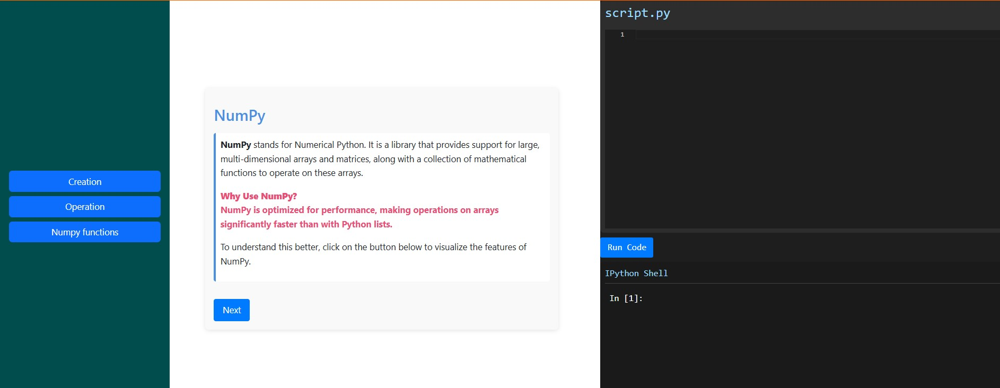
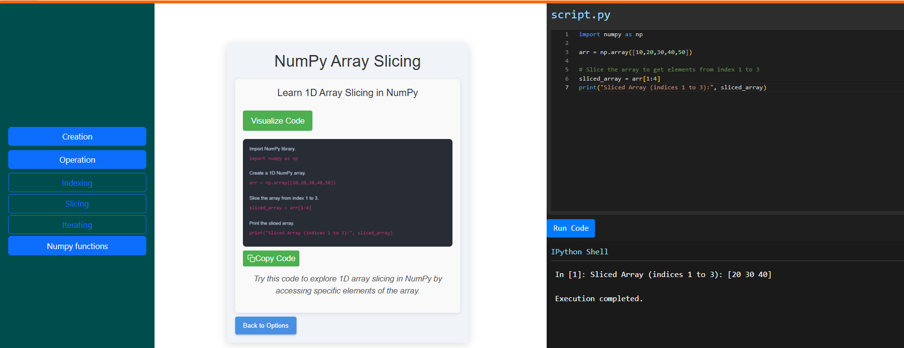
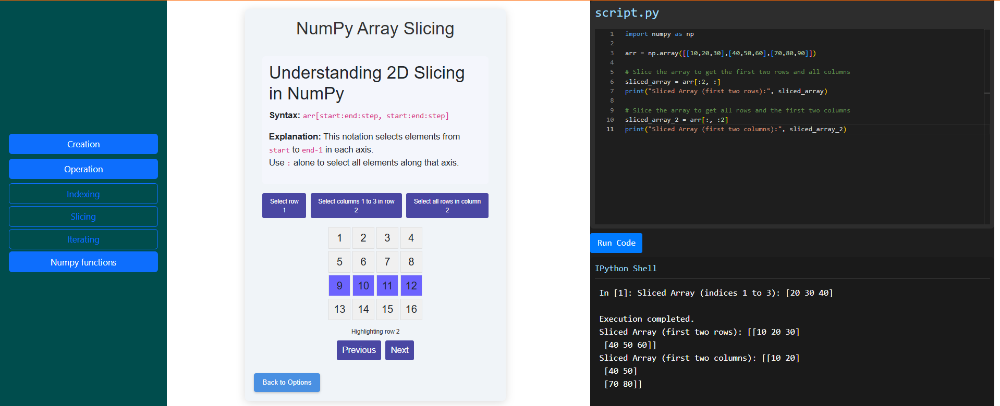

### Procedure

The interface consists of three sections: the left section features a main button for selecting topics, the center section displays the concept, and the right section includes a code editor where you can run the code.

Click the "Creation" button to begin learning NumPy.

Click the "Next" button to view the code example. Try running the code in the code editor and observe the differences between a Python List and a NumPy Array.

Click the "Visualization" button to see a visual comparison between a Python List and a NumPy Array.

Now, select <b>"Operation" </b>from the left section to explore various NumPy array operations.

Choose "Indexing" from the options to learn how indexing is performed in NumPy.

Copy the code and run it in the code editor. Observe the output result. Then, look for the "Visualize" button at the top and click on it to see the indexing process visually.

Similarly, perform the other two types of indexing and observe how they work. Run the code in the editor, check the output, and use the "Visualize" button to understand the process better.

Now, choose the "Slicing" option from the main section to learn about slicing in NumPy arrays

Copy the code and run it in the code editor. Observe the output result. Then, look for the "Visualize" button at the top and click on it to see the indexing process visually.

Similarly, perform the other two types of slicing and observe how they work. Run the code in the editor, check the output, and click the "Visualize" button to gain a clearer understanding of the process.

Select "Iteration" from the options to observe and learn how iteration works in NumPy

Click the "Next" button and pay attention to the code highlighting to gain a better understanding of the structure and flow of the code.

Select "NumPy Functions" to learn about the arange, argmax, linspace, and other useful NumPy functions.

Follow the instructions carefully and run the code in the code editor to see how the functions like arange, argmax, and linspace work in NumPy.

Input the required values, click on the "Visualize" button, and then use the "Next" button to see the visualization of the process.

Similarly, perform the two other functions, follow the instructions carefully, and understand how each function works by running the code and visualizing the process.

